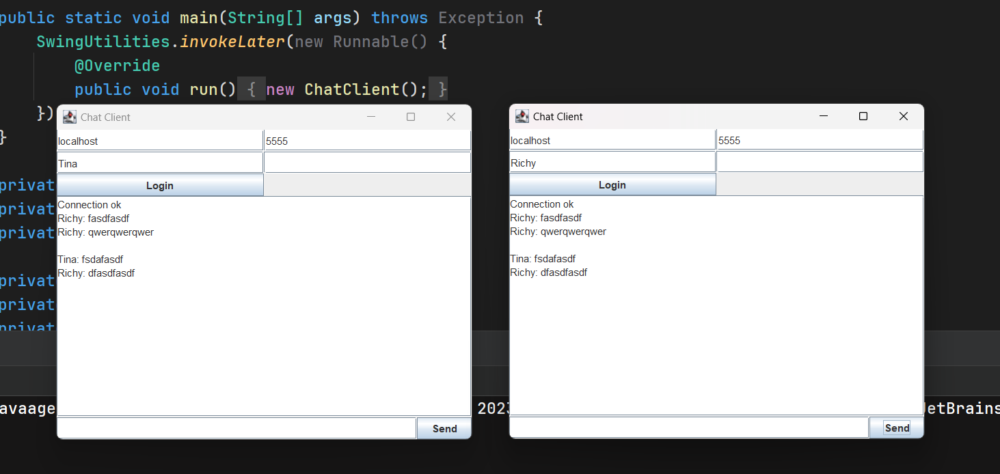

Чот усложнил себе задачку с сокетами и потоками)
При запуске сервера чата без GUI - работает. 
А GUI при подвисает при нажатии старт. Пока не разобрался) 

[ConnectionServer.java](src%2Fmain%2Fjava%2Forg%2Fgr40in%2FConnectionServer.java)

```java
package org.gr40in;

import java.io.BufferedReader;
import java.io.BufferedWriter;
import java.io.IOException;
import java.net.ServerSocket;
import java.nio.file.Files;
import java.nio.file.Path;
import java.util.ArrayList;
import java.util.List;

public class ConnectionServer implements ConnectionListener {
    public static void main(String[] args) {
        try {
            new ConnectionServer();
        } catch (IOException e) {
            System.out.println("server failed");
        }
    }

    public List<ChatConnection> connectionList = new ArrayList<>();
    private static Path logPath = Path.of("log.txt");
    public static BufferedWriter logWriter;
    public static BufferedReader logReader;

    static {
        try {
            logWriter = Files.newBufferedWriter(logPath);
            logReader = Files.newBufferedReader(logPath);
        } catch (IOException e) {
            System.out.println("logging failed");
        }
    }

    public ConnectionServer() throws IOException {
        try (ServerSocket serverSocket = new ServerSocket(5555)) {
            while (true) {
                ChatConnection newChat = new ChatConnection(serverSocket.accept(), this);
                connectionList.add(newChat);
                newChat.sendMessage(getLog());
                System.out.println("connect ok");
            }
        } catch (IOException e) {
            logWriter.close();
            throw new RuntimeException(e);
        }
    }

    @Override
    public synchronized void getMessage(String message) {
        sendMessage(message);
    }

    @Override
    public synchronized void sendMessage(String message) {
        if (!message.isEmpty()) writeToLog(message + "\n");
        try {
            for (ChatConnection chat : connectionList) {
                chat.sendMessage(message);
            }
        } catch (IOException e) {
            throw new RuntimeException(e);
        }
    }

    public synchronized void writeToLog(String data) {
        try {
            logWriter.append(data);
            logWriter.flush();
        } catch (IOException e) {
            throw new RuntimeException(e);
        }
    }

    public synchronized String getLog() {
        StringBuilder builder = new StringBuilder();
        try {
            logReader = Files.newBufferedReader(logPath);
            String line = "";
            while ((line = logReader.readLine()) != null) builder.append(line).append("\n");
        } catch (IOException e) {
            throw new RuntimeException(e);
        }
        return builder.toString();
    }

    @Override
    public synchronized void disconnect(ChatConnection connection) {
        connectionList.remove(connection);
    }
}
```

[ChatConnection.java](src%2Fmain%2Fjava%2Forg%2Fgr40in%2FChatConnection.java)

```java
package org.gr40in;

import java.io.*;
import java.net.Socket;

public class ChatConnection extends Thread {
    Socket socket;
    Thread thread;
    ConnectionListener listener;
    BufferedReader bufferedReader;
    BufferedWriter bufferedWriter;
    User user;

    public ChatConnection(String ip, int port, ConnectionListener listener) throws IOException {
        this(new Socket(ip, port), listener);
    }

    public ChatConnection(Socket socket, ConnectionListener listener) throws IOException {
//        this.user = user;
        this.listener = listener;
        this.socket = socket;
        bufferedReader = new BufferedReader(new InputStreamReader(socket.getInputStream()));
        bufferedWriter = new BufferedWriter(new OutputStreamWriter(socket.getOutputStream()));

        this.start();
    }

    @Override
    public void run() {
        try {
            while (!isInterrupted()) {
                listener.getMessage(bufferedReader.readLine());
            }
        } catch (IOException e) {
            listener.disconnect(this);
        }
    }
    public synchronized void sendMessage(String message) throws IOException {
        bufferedWriter.write(message + "\n");
        bufferedWriter.flush();
    }
}

```

[ChatClient.java](src%2Fmain%2Fjava%2Forg%2Fgr40in%2FChatClient.java)

```java
package org.gr40in;

import javax.swing.*;
import java.awt.*;
import java.awt.event.ActionEvent;
import java.awt.event.ActionListener;
import java.io.*;

public class ChatClient extends JFrame implements ConnectionListener {

    public static void main(String[] args) throws Exception {
        SwingUtilities.invokeLater(new Runnable() {
            @Override
            public void run() {
                new ChatClient();
            }
        });
    }

    private User user;
    private String server = "localhost";
    private int port = 5555;

    private final int HEIGHT = 400;
    private final int WIDTH = 500;
    private final JTextArea log = new JTextArea();
    private final JPanel panelTop = new JPanel(new GridLayout(3, 2));
    private final JTextField tfIPAddress = new JTextField(server);
    private final JTextField tfPort = new JTextField(String.valueOf(port));
    private final JTextField tfLogin = new JTextField("Richy");
    private final JPasswordField tfPassword = new JPasswordField("");
    private final JButton btnLogin = new JButton("Login");
    private final JPanel panelBottom = new JPanel(new BorderLayout());
    private final JTextField tfMessage = new JTextField();
    private final JButton btnSend = new JButton("Send");

    private ChatConnection connection;

    public ChatClient() throws HeadlessException {

        setDefaultCloseOperation(WindowConstants.EXIT_ON_CLOSE);
        setLocationRelativeTo(null);
        setSize(WIDTH, HEIGHT);
        setTitle("Chat Client");
        panelTop.add(tfIPAddress);
        panelTop.add(tfPort);
        panelTop.add(tfLogin);
        panelTop.add(tfPassword);
        panelTop.add(btnLogin);
        btnLogin.addActionListener(new ActionListener() {
            @Override
            public void actionPerformed(ActionEvent e) {
                try {
                    ChatClient.this.connection = new ChatConnection(tfIPAddress.getText(),
                            Integer.parseInt(tfPort.getText()),
                            ChatClient.this);
                    log.append("Connection ok\n");
                } catch (IOException ex) {
                    throw new RuntimeException(ex);
                }
            }
        });
        add(panelTop, BorderLayout.NORTH);

        panelBottom.add(tfMessage, BorderLayout.CENTER);
        panelBottom.add(btnSend, BorderLayout.EAST);
        btnSend.addActionListener(new ActionListener() {
            @Override
            public void actionPerformed(ActionEvent e) {
                if (tfMessage.getText().equals("")) return;
                try {
                    connection.sendMessage(tfLogin.getText() + ": " + tfMessage.getText());
                    tfMessage.setText("");
                } catch (IOException ex) {
                    throw new RuntimeException(ex);
                }
            }
        });

        add(panelBottom, BorderLayout.SOUTH);
        log.setEditable(false);
        JScrollPane scrollLog = new JScrollPane(log);
        add(scrollLog);
        setVisible(true);
    }

    @Override
    public void connectionOk(ChatConnection connection) {

    }

    @Override
    public void getMessage(String message) {
        log.append(message + "\n");
    }

    @Override
    public void sendMessage(String message) {
        log.append(message);
    }

    @Override
    public void disconnect(ChatConnection connection) {
        try {
            connection.sendMessage(tfLogin.getText() +" is exit :(");
        } catch (IOException e) {
            System.out.println("logout");
        }
    }
}
```